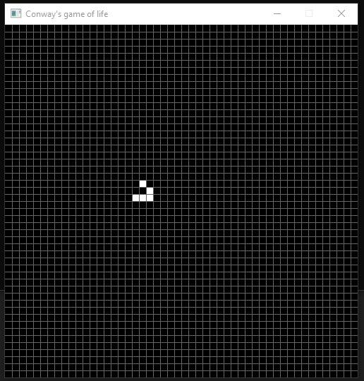

# Conway's Game of Life
Life and death are now fighting in this pretty game created by the British mathematician John Horton Conway in 1970. He wanted to invent a game with the simplest rules possible to simulate diversity of different forms, such as evolution may create. The rules are really simple: https://playgameoflife.com/info You just need to dye some cells white by mouse clicking and watch, watch while the live is evolving, creating either cute or owful forms.  
  
## Build
To build the project, you need:
1.	download and unpack the source code package from this site
2.	create a "build" folder in the project directory
3.	open cmd.exe in this folder, or open it anywhere and use this command (on Windows):
```
cd "Path to the build folder" 
```
4.	run next command to create CMake configuration:
```
cmake ../src 
```  
or you can opt for a C++ compiler like so instead, MSVC and MinGW compilers will work for sure:  
```  
cmake ../src -DCMAKE_CXX_COMPILER="Path to your compiler"
``` 
5.	run this command to build the project and create .exe file:
```
cmake --build .
``` 
6.	CMake will write the path to .exe file in the command line, open that folder, or run the next command:
```
cd "Path to .exe file" 
```
7.	Add sdl2.dll to the folder with .exe file if it hadn't been added automatically, it can be located in these folders, depending on your processor architecture and compiler:  
- GNU/SDL2-2.30.2/x86_64-w64-mingw32/bin  
- GNU/SDL2-2.30.2/x86_64-w64-mingw32/bin  
- MSVC/SDL2-2.30.2/lib/x64  
- MSVC/SDL2-2.30.2/lib/x86  
  
## Run
After building, run the next command (on Windows):
start console_game_of_life.exe 7 700 500 
where 7 is the speed of the game from 1 to 10,
700 is the window width from 100 and is a multiple of 10,
500 is the window height from 100 and is a multiple of 10 You will see such a window:
  
You will understand if the game is running by the window title:  
   